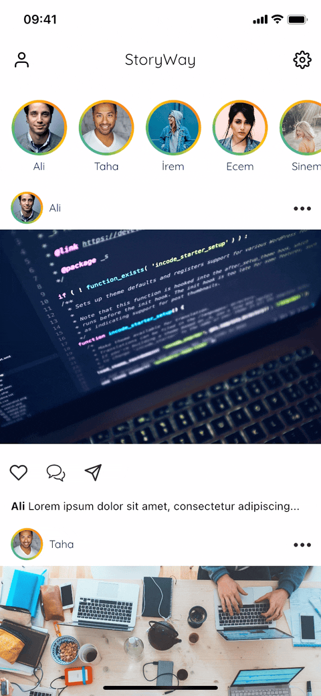

# StoryWay

StoryWay is the new way of implementing the Instagram like stories functionality
in Flutter. Most of the other implementations rely on navigating through a 
list of stories of users. In my opinion, it is also possible to apply same effect
without navigating, however using pagers. PageView is a very powerful Widget that
enabled the way of implementing this functionality.

Not only that, the implementation has been made via respecting the SOLID principles.

- Clean Architecture with Data, Domain and Presentation layers
- Dependency Injection on Preferences (Hive, Shared Preferences) and Database (Hive, Sqflite)
- MVVM-like Architecture with Cubit State Management
- Simple Event Driven Architecture on story implementation
- Ready-to-use JSON dataset with service layer that simulates API calls
- Sliver Tab Bar implementation with NestedScrollView, GridView and ListView
- Powerful, fast and good looking animations
- Dark Theme support
  
## You want sneak peeks? There are sneak peeks!

* Cubic Transition

* Tap left or right to pass stories or users

* Swipe to close stories

* Start from where you left off
* 1.5 seconds to make a story seen, its a design choice and can be reduced
* Video is recorded with 2.5 seconds of seen time

* Tap profile picture to see profile, swipe between pages to see stories or posts

* Change injected dependencies
* Restart required!

* Change theme

## Getting Started

Install Flutter if not available in your computer from:
- [Official Flutter Website](https://docs.flutter.dev/get-started/install)
- Version implemented: Channel stable, 3.3.10

Install Android Studio if available in your computer form:
- [Official Android Studio Website](https://developer.android.com/studio?gclid=Cj0KCQiA8t2eBhDeARIsAAVEga3YBXLFbK_rctgmI8ZyoWuHS9iifuVni2fSbmYtVBA5e5KQs3ioBPEaAslgEALw_wcB&gclsrc=aw.ds)
- Version implemented: Android SDK version 33.0.0, Android Studio (version 2022.1)

Install XCode from AppStore if you are using macOS
- Version implemented: Xcode 14.2

Install VSCode from:
- [Official VSCode Website](https://code.visualstudio.com/)

Install these required extensions for VSCode in order to be able to run Flutter:
- Dart
- Flutter

Then just run the app. 

!!! Important:
- If you are using iOS emulator, as the video_player package relies on AVMediaPlayer, the app will crash due to unavailability of the player. Try to run on a real device for iOS tests.
